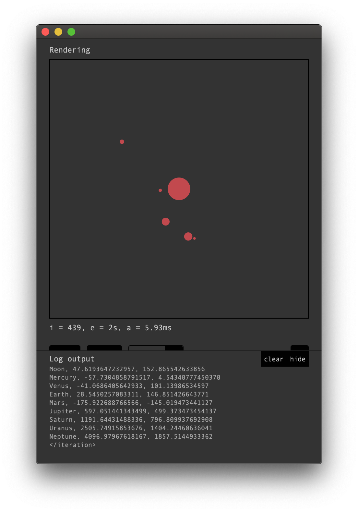

## Charlie, a tiny discrete simulation framework

#### Description

Charlie is a very small application to run discrete simulations written in C-Sharp and deployed as .dll files. It consists of a graphical user interface as well as a command line application. 

The software provides the following functions:

- Load and unload simulations from .dll files (*see the section Simulation development for more informations on the simulation definition*)
- Configure and initialize the loaded simulation through textual key value pairs
- Run the simulation for a fixed number of time steps or run it continously
- Render an image of the simulation at each discrete timestep
- Save renderings of the simulation as image files
- View the time needed to update the simulation state, the total elapsed time and the current iteration of the simulation
- View log output of the simulation after each simulation update
- Write the generated log output into a textfile

The software is written in C# and should run under Linux, Windows and MacOS. That said, I am not certain if that is actually the case, as version 0.1.0 was only tested under MacOs and Linux. Version 0.2.3 worked under MacOS but failed on the Linux system used for testing. The application tested under Windows.

Further development on this software is not planned as the software only served as tool for my bachelor thesis. Feel free to contact me via jakobrdev@gmail.com if you have questions regarding the software. Please don't be disappointed if I don't reply, as the software does not have my highest priority. :/

#### Installation

The software can be installed throught the following steps:

- Download a release package from the [release folder](https://github.com/TheRainbowPalace/charlie/tree/master/release). 
  It is adviced to use [version 0.2.3](https://github.com/TheRainbowPalace/charlie/blob/master/release/charlie-v0.2.3.zip) as version 0.1.0 is contains all kinds of peculiarities.

- Unzip the package to your preferred installation location
- **Note**: If you want to compile the application manually follow the instructions in the section "Development on Charlie" below.

The following **dependencies** must be installed in order to use the software:

- The graphical user interface library **GTK+**, which can be found [on the GTK+ website](https://www.gtk.org).

  - **Note**: The GTK+ library is linked dynamically at runtime, therefore the GTK+ library is not necessary if the software is only run from the command line.

- The **Mono runtime**, which can be found [on the Mono project website](https://www.mono-project.com/download/stable/#download-lin).

  - **Note**: The Mono runtime is already deprecated and modern C# applications use the [.NET framework](https://dotnet.microsoft.com). But at the time the application was developed the functions to unload .dll content into a running C# application weren't available in the at that time new .NET framework (I don't know if they are today, if so, it would be time to update Charlie to .NET)

  

#### Usage

Inside the extracted package follow one of these instructions:

Run the application through the **graphical user interface**:

- If you are running Windows: doubleclick on `bin/Charlie/charlie.exe` and the application should start
- If you are running MacOs doubleclick on `bin/Charlie.app` and the application should start. 
  **Note**: The .app extension is probably not visible, just click on `bin/Charlie` with the colorful symbol. ;)
- For all other systems: `mono bin/Charlie/charlie.exe`
- See a full description of the graphical user interface in the below section "Graphical user interface"

Run the application from **command line** (bash shell):

- Navigate to `./bin/Charlie` (e.g. via `cd bin/Charlie`)
- Execute `mono charlie.exe --help`
- **Note**: The information provided by `--help` are not up to date, the `--init` function was removed and the`--run` option, which allows to run simulations without the graphical user interface (and is the only function of the command line version) has additional parameters
- Run a simulation with `mono charlie.exe --run <path-to-your-simulation-file> <number of iterations the simulation should run for e.g. 10> <the number of repetitions the simulation should run for e.g. 1>

#### Graphical user interface

**Note**: The provided pictures below may not look exactly the same on your system, as GTK uses different styles for each system (Linux, MacOs & Windows).

The usage of Charlie normally goes as follows: 

1. Load a simulation

2. Configure the simulation

3. Initialize the simulation

4. Run & control the simulation
5. Examine the simulation output

This process is described in more detail and with images in the following part of this section.

**1. Load a simulation**

- The first time a simulation is loaded is a bit annoying because a combination of the path of the simulation .dll file and the simulation namespace + classname (here called **abstract path**) must be provided, this might look like the following on MacOs:
  `/Users/Jakob/Documents/sensorpositioning/simulation.dll:SensorPositioning.StaticSpSimulation`
  - The first part `/Users/Jakob/Documents/sensorpositioning/simulation.dll` is the location of the .dll file. Note that the name of the .dll file does not have to end with ".dll", e.g. the Hello World simulation is run from "charlie.exe".
  - The second part `:SensorPositioning.StaticSpSimulation` defines the namespace + the classname of the simulation. So here the class named `StaticSpSimulation`is loaded from the namespace `SensorPositioning`. Namespaces can have an arbatrary depth so just put it all infront e.g. `NamespaceOne.NamespaceTwo.NamespaceThree.YourSimulation`.
    Very import is the doublequote `:` infront, it separates the simulation path from the namespace + classname and should not be missing.
  - An invalid path, a non existing class inside a file or other loading errors are shown as popup window, if an error occured the Hello World simulation is loaded instead.
  - When the application is started the text field for the abstract path is filled with the abstract path of the Hello World simulation. Simply click the "Load" button to load it.
  - Copy and paste the abstract path inside the text area and the press the Load button.
  - The name and description of the simulation is then presented. In the image below, e.g. the simulation "Hello World" is loaded, its description informs about the simulation API of Charlie. Also a button appears under the entry field for the abstract path, with the name of the simulation. By clicking on it, the simulation is loaded. So it is only necessary once to enter the abstract path of a simulation.

**2. & 3. Configuration & Initilization**

- It is possible to configurate the simulation through Charlie. The configuration must be done before the simulation is initialized, as the current configuration is passed as a copy in the initialization step. In the image below the configuration is shown for the "Hello World" simulation. 
  For the Hello World simulation the configuration does not do anything, as it is only provides as an example, but you can load a second example simulation by changing the abstract path from `.../charlie.exe:charlie.HelloWorld` to `.../charlie.exe:charlie.WaveExample`. By changing the configuration of the wave example, reinitializing and starting it the changes of the configuration can be seen.

- For more information on the configuration format see the section "Your own simulation" below.
- The simulation can be reloaded to reset the configuration to the default settings.
- Besides the simulation specific configuration, Charlie provides general configurations for a simulation. They can be found underneath the control area and are shown in the following pictures:
  
  - The first option adds an artificial delay between each update call. This can be used to slow down the simulation and look at individiual states of the simulation without having the need to manually click.
    **Note**: Sadly it has to be noted, that the version 0.2.3 apparently has a bug and the delay is not updated.
  - The second option defines if the log output should be written to file.
  - Underneath these options the version of Charlie can be found.

**4. Run & control the simulation**

- The controls of the simulation can be seen in the image below:
  
  - The `Init` button initializes the function after the configuration has been changed or simply to restart the simulation. After the simulation has been loaded the simulation is automatically initialized.
  - The simulation can be started and stopped with the `Start` button.
  - To run the simulation only for a defined number of timesteps the `R` button can be used. It runs the simulation for the defined number of steps defined in the field left to it.
  - The `P` button saves the current render output as .png file inside the home directory of the user in the following folder  `.charlie/<abstract-path>`
  - The field `i = 0, e = 0s, a = 0ms` shows the current iteration `i` the total elapsed time the simulation has already taken in seconds (the time when the simulation is paused is excluded) and `a` is the average time a simulation update takes in milli seconds.

**5. Examine the simulation output**

- A simulation provides rendered images and textual log output. The prior is always shown in the "Rendering" area as seen in the image below. The log output can be shown and hidden through the "hide" button seen below. The log output can also be cleared with the "clear" button.
  **Note**: It is not possible to scroll up and down in the log output.

  

- If the log output is written into a file it is possible to process it further through other applications.

#### Your own simulation

To get started writing your own simulation take a look at the examples folder in `src/Examples`. It contains two Simulation examples the previously shown Hello World simulation in `HelloWorld.cs` and a simulation that plots a sinus wave (`WaveExample.cs`). 

Both examples implement the interface `ISimulation.cs`, wich can be found in the examples folder as well. The interface contains all functions that should be implemented and are called from Charlie. Indeed it is not necessary to implement the interface in your simulation class, but it provides convenience.

**Note**: Even though Charlie currently doesn't work with the .NET SDK, simulations can be build with the .NET SDK.

To start **building a simulation**:

- Install the .NET SDK which includes the `dotnet` tool, which manages .NET projects, the SDK can be found [here](https://dotnet.microsoft.com/learn/dotnet/hello-world-tutorial/install). 

- Create a new .NET project with `dotnet new classlib -o <project-name>`
- Copy the `ISimulation.cs` file into the new created project folder
- Enter the new project folder with `cd <project-name>`
- Install the dependency "Cairo" with `dotnet add package cairosharp`. Cairo is a library used to render 2D graphics. It can be used to render the simulation state in 2D but a different rendering library e.g. a 3D rendering library could be used.
- Run `dotnet build` 
- Load and run the simulation as described above under "Usage"

The **simulation API**:

- A simulation contains the following functions:
  - `string GetTitle ()` 
  - `string GetDescr ()`
  - `string GetMeta ()`
  - `string GetConfig ()`
  - `void Init ( Dictionary< string, string > config )`
  - `void Update ( long deltaTime )`
  - `byte[] Render ( int width, int height )`
  - `string Log ()`
  - `void End ()`
- All "Get" Functions are static and are called directly when the simulation is loaded from its .dll library.
- The function `GetTitle ()` returns the title of the Simulation.
- The function `GetDescr ()` returns a description of the Simulation, e.g. what it does, usage informations or anything you find important to note.
- The function `GetMeta ()` is currently not really used but contains a string like `Author: Lina; Version: 1.3.1` containing key value pairs separated by a semicolon with meta information about the simulation.
- The function `getConfig ()` defines the default configuration that is presented and can be edited by the user. 
  The configuration is preparsed through Charlie. All white lines and lines starting with a hashtag (comments) are removed. After that each line is passed as is, if no `=` is present. 
  If an equal sign is present the line is split into a tuple of a key and value. Everything before the first equal sign is the key and everything after the equal sign is the value.
- The parsed configuration is passed to the `Init ( Dictionary< string, string > config )` function, which receives the key values pairs as dictionary of strings. The 
- Each update of the simulation the `Update ( long deltaTime )` function is called first and afterwards the `Render ( int width, int height )` function.
  - The update function receives the times passed inbetween each update (delta time).
  - The render function receives a width and height for the image that should be rendered. The image is then returned as byte array in an ARGB32 format. This allows to run Charlie on a server as command line application.
- The `Log ()` function returns logging information which can be stored separated by a linebreak in a text file and can also be seen in Charlie directly. Even though the file contains a .txt ending the format that is stored inside the file is up to the log function. The log function is called after the update function.
  - To log for e.g. in .csv format the log function could return the CSV header after the initilization (the log function is called for the first time after the initialization). To differ between initialization and normal update call a variable could be stored in the simulation containing the current simulation step.
- Finally the `End ()` function can be used to terminate e.g. network or file handlers, end threads and e.g. run final calculations. It is called when the simulation is terminated, that is:
  - If the simulation is reinitialized
  - If a new simulation is loaded
  - If Charlie is terminated

#### Development on Charlie

The project never reached a major release. Therefore it contains code that is not in use or sections that are commented out. Also a lot of documentation in the code itself is missing. That said, lets begin. :)

To start development on the project, follow these steps:

- `git clone https://github.com/TheRainbowPalace/charlie.git`
- `cd charlie` 
- `./build.sh`
- Start charlie as described above
- If you are using MacOs the `build_mac_os.sh` script can be used alternativly. It creates an app bundle for MacOs inside the "bin" folder.

You can create releases with the `pack_release.sh` script. They will be stored under the current version number in the `release` folder. The version can be changed in the source file `src/Charlie.cs`.

The following is a short **description for each folder and file** in the main directory:

- `src` contains the C# source code of the application. It is the perfect starting point to work on Charlie.
- The `charlie.csproj` file is the project description file. There build settings can be changed. New dependencies for the project can be added here.

- All files ending with .sh are bash shell scripts and are used to build or create an release of the application.
- `build-resources` and `resources` contain resources that are copied when building the application. They contain e.g. a stylesheet for the graphical user interface or an empty app bundle structure for a MacOs build.
- The `release` folder contains all releases of Charlie as .zip files.
- The `images` folder contains images of the graphical user interface that are used inside this Readme file.
- The `todo.md` file contains a list of issues that should be fixed in the application.

The source folder contains the following:

- The `Examples` folder contains the "Hello World" and "Wave Example" simulations
- The `Program.cs` is the entry point of the application. It is very short and starts either the graphical user interface, which can be found in the `Graphical` folder or the command line interface, which can be found in the `Shell` directory.
- The `Simulator` folder contains the general simulation library. It is used by the graphical aswell as the command line application.
- The `Logger.cs` file is a tiny class to log events to the consol with different styles. It is used in the `Simulator.cs` as well as in the graphical and commandline application.
- The `Playground` folder is only used to play around with code that is not relevant for the rest of the application.

#### Licence

From the following MIT licence excluded is the `src/Examples` folder which can be used as basis for new simulations, although it also comes WITHOUT WARRENTY OF ANY KIND.

**The MIT License (MIT)**

Copyright © 2020 Jakob Rieke

Permission is hereby granted, free of charge, to any person obtaining a copy of this software and associated documentation files (the “Software”), to deal in the Software without restriction, including without limitation the rights to use, copy, modify, merge, publish, distribute, sublicense, and/or sell copies of the Software, and to permit persons to whom the Software is furnished to do so, subject to the following conditions:

The above copyright notice and this permission notice shall be included in all copies or substantial portions of the Software.

THE SOFTWARE IS PROVIDED “AS IS”, WITHOUT WARRANTY OF ANY KIND, EXPRESS OR IMPLIED, INCLUDING BUT NOT LIMITED TO THE WARRANTIES OF MERCHANTABILITY, FITNESS FOR A PARTICULAR PURPOSE AND NONINFRINGEMENT. IN NO EVENT SHALL THE AUTHORS OR COPYRIGHT HOLDERS BE LIABLE FOR ANY CLAIM, DAMAGES OR OTHER LIABILITY, WHETHER IN AN ACTION OF CONTRACT, TORT OR OTHERWISE, ARISING FROM, OUT OF OR IN CONNECTION WITH THE SOFTWARE OR THE USE OR OTHER DEALINGS IN THE SOFTWARE.